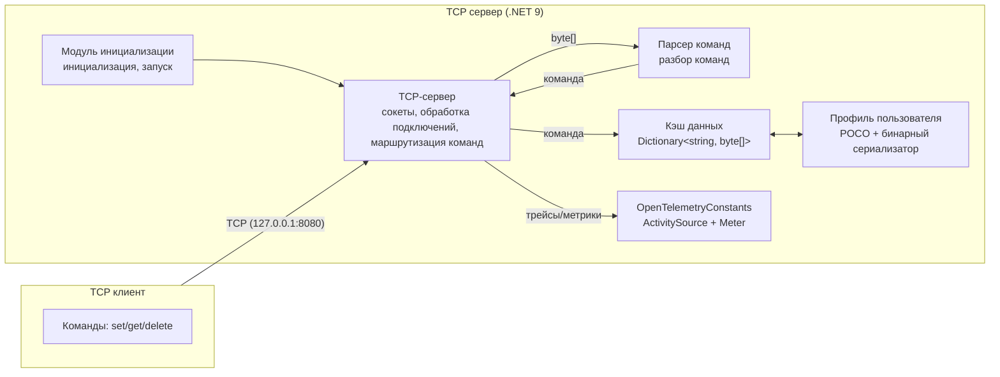

# CsharpInDepth
https://otus.ru/lessons/csharp-in-depth/

## Описание проекта TspServer

**TspServer** — это обучающий TCP‑сервер на .NET 9, реализующий простое in‑memory хранилище пользовательских профилей с телеметрией через OpenTelemetry.

### Основные возможности

- **TCP‑сервер**: принимает подключения по адресу `127.0.0.1:8080` (по умолчанию) и обрабатывает текстовые команды.
- **Простое хранилище**: `SimpleStore` хранит объекты `UserProfile` в памяти процесса с потокобезопасным доступом (ReaderWriterLockSlim).
- **Модель данных**: `UserProfile` (Id, Username, CreatedAt) сериализуется в бинарный формат (source‑generator `GenerateBinarySerializer`) для хранения и в JSON для обмена по сети.
- **Команды протокола**:
  - `set <key> <json>` — сохранить/обновить профиль по ключу;
  - `get <key>` — получить профиль по ключу;
  - `delete <key>` — удалить профиль по ключу.
- **Ответы сервера**:
  - `OK\r\n` — успешное выполнение команд `set`/`delete`;
  - JSON‑объект профиля — успешный `get`;
  - `(nil)\r\n` — значение по ключу не найдено;
  - `-ERR Unknown command\r\n` — неизвестная команда.

### OpenTelemetry

- В `Program.cs` настраиваются:
  - **Tracing** (`ActivitySource` `TCP server`) с выводом в консоль;
  - **Metrics** (`Meter` `TCP server`) с периодическим экспортом в консоль.
- В `TcpServer` собираются метрики:
  - `operations.count` — количество обработанных запросов;
  - `operations.time` — время обработки запроса (гистограмма).

### Архитектура приложения

- **Точка входа (`Program.cs`)**:
  - конфигурирует OpenTelemetry (ресурс, трассировки, метрики);
  - создаёт экземпляры `SimpleStore` и `TcpServer`;
  - запускает сервер и обрабатывает завершение через `CancellationToken` (Ctrl+C).
- **Сетевой слой (`TcpServer`)**:
  - открывает TCP‑слушатель (`Socket`) на заданном IP/порту;
  - принимает подключения и для каждого клиента поднимает фоновую задачу обработки;
  - использует общий семафор `_serverSemaphore` для ограничения числа одновременных клиентов и отдельный `SemaphoreSlim` на каждый сокет для последовательной обработки запросов;
  - читает данные в буфер, разбирает команду и отправляет ответ через тот же сокет.
- **Парсинг команд (`CommandParser<T>`, `CommandParts<T>`)**:
  - обрабатывает входной `Span` и делит его на три части: `Command`, `Key`, `Value` по разделителю (пробел);
  - не создаёт лишних аллокаций, работая поверх `Span`/`ReadOnlySpan`.
- **Прикладная логика (обработка запросов)**:
  - в `TcpServer.RequestProcessingInternal` по значению `command` (`get`, `set`, `delete`) вызываются методы `SimpleStore`;
  - сериализация/десериализация:
    - сетевой формат — JSON (`System.Text.Json`);
    - формат хранения — бинарный (методы `SerializeToBinary` / `DeserializeFromBinary`, сгенерированные source‑генератором).
- **Хранилище (`SimpleStore`)**:
  - in‑memory `Dictionary<string, byte[]>` с `ReaderWriterLockSlim` для потокобезопасного доступа;
  - считает статистику операций (`set/get/delete`) через атомарные счётчики;
  - реализует `IDisposable` и корректно освобождает ресурсы.
- **Модель (`UserProfile`)**:
  - простая POCO‑модель с атрибутом `[GenerateBinarySerializer]` для генерации бинарного сериализатора;
  - содержит поля `Id`, `Username`, `CreatedAt`.
- **Телеметрия (`OpenTelemetryConstants`, использование в `TcpServer`)**:
  - `ActivitySource` — оборачивает обработку запроса в `Activity` с тегами (имя команды, ключ, размер);
  - `Meter` — предоставляет счётчик `operations.count` и гистограмму `operations.time`.

### Схема приложения



### Запуск

- Соберите и запустите проект (папка `bin/Debug/net9.0` или из IDE):
  - при старте выводится `Application started...` и информация о запуске OpenTelemetry;
  - сервер слушает TCP‑порт `8080` до нажатия `Ctrl+C`.
- Для тестирования можно использовать любой TCP‑клиент (например, `telnet`, `nc` или простую самописную утилиту) и отправлять команды в формате:

```text
set user1 {"Id":1,"Username":"Alice","CreatedAt":"2025-01-01T00:00:00Z"}
get user1
delete user1
```

